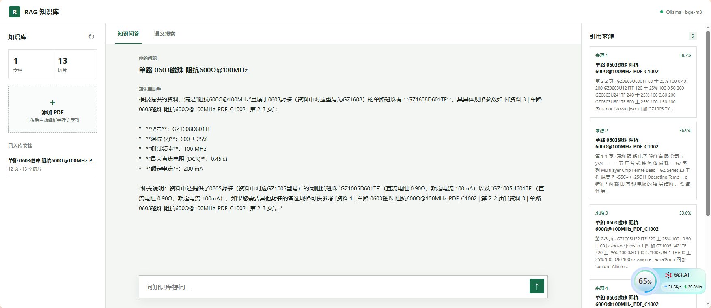

# PDF RAG Pipeline

一个端到端的 **本地优先** PDF 检索增强生成（RAG）系统，用 Node.js / TypeScript 构建。把 PDF 变成可问答的知识库——支持扫描版 OCR、本地向量存储、多后端对话模型，并自带 Web 工作台。



## 核心特性

- **PDF 解析**：原生文本层用 `pdf-parse` 提取；扫描版 / 图片型 PDF 自动走 PDF.js + Tesseract.js 中英文 OCR
- **智能切块**：按目标字符数滑动窗口切块，优先在段落、句末、空格处断开，保留页码范围
- **本地向量库**：基于 LanceDB，无需 Docker / PostgreSQL；数据落在 `data/lancedb/`
- **Embedding 灵活可选**：默认走本地 Ollama `bge-m3`，也可切到任意 OpenAI 兼容 embedding 服务
- **对话后端可插拔**：`CHAT_PROVIDER` 一行切换 `anthropic` / `openai` / `ollama`，适配各类中转站
- **引用追溯**：每个回答都标注来源文件、页码范围、相似度分数
- **Web 工作台 + 命令行 CLI**：既能可视化操作，也能脚本化批处理
- **中间产物可观测**：每份 PDF 落盘 `document.md`、`document.json`、`chunks.json`，方便调试

## 工作流

```text
PDF ──┬─ pdf-parse (文本层) ─────────┐
      └─ PDF.js + Tesseract.js (OCR) ─┘
                ↓
        Markdown + 按页文本
                ↓
          滑动窗口切块
                ↓
       Ollama bge-m3 Embedding
                ↓
           LanceDB 持久化
                ↓
     检索时：cosine 近邻 + 重排
                ↓
  组装上下文 → Chat 模型（Anthropic / OpenAI / Ollama）
                ↓
          附带引用来源的回答
```

## 环境要求

- **Node.js 20+**（推荐 22 LTS）
- **Ollama**（用于本地 embedding，必装）
  - 安装：https://ollama.com/
  - 拉模型：`ollama pull bge-m3`
- **Tesseract 语言包**（仅扫描版 PDF 需要）
  - 项目根目录建 `tessdata/`，放入 `chi_sim.traineddata` 和 `eng.traineddata`

## 快速开始

```bash
npm install
cp .env.example .env       # Windows PowerShell: Copy-Item .env.example .env
npm run web
```

浏览器打开 http://127.0.0.1:3000 即可看到工作台。

> 截图所示界面分三栏：左侧知识库与上传、中间对话区、右侧引用来源。

## Web 工作台功能

启动：

```bash
npm run web
```

页面提供：

1. **知识库概览**——文档数、切片数实时统计
2. **PDF 上传**——拖入或选择文件，自动解析 → OCR（如需）→ 切块 → embedding → 入库
3. **已入库文档列表**——显示文件标题、页数、切片数
4. **知识问答模式**——输入问题，检索 Top-K 片段，调用对话模型生成带引用的回答
5. **语义搜索模式**——只返回匹配片段，不调用对话模型，速度更快
6. **引用来源面板**——每条来源展示相似度百分比、文件标题、页码范围、内容预览

所有请求都打到本机 Express 服务，再分别调用 Ollama（embedding）和配置的对话后端。

## 命令行 CLI

```bash
# 只解析 + 切块，不入库（无需 Ollama / .env）
npm run dev -- extract ./pdfs/example.pdf

# 导入单个 PDF（解析 → 切块 → embedding → LanceDB）
npm run dev -- ingest ./pdfs/example.pdf

# 递归导入整个目录
npm run dev -- ingest ./pdfs

# 语义检索（返回 JSON，含分数、原文、来源、页码）
npm run dev -- search "这份文档的核心结论是什么？" --limit 5

# RAG 问答（检索 + 对话模型生成答案）
npm run dev -- ask "这个电阻的额定功率是多少？" --limit 5

# 查看库里已有的文档和切片
npm run dev -- inspect --limit 10
npm run dev -- inspect --limit 5 --vectors
```

## 中间产物

每份 PDF 会在 `output/<文件哈希前12位>/` 下生成：

| 文件 | 内容 |
| --- | --- |
| `document.md` | 按页组织的 Markdown，便于人工浏览 |
| `document.json` | 文档元数据 + 页级纯文本 + PDF info 字段 |
| `chunks.json` | 切块文本、页码范围、字符长度估算的 token 数 |

向量不写到这里，避免目录膨胀；embedding 直接进 LanceDB。

## 配置

通过 `.env` 配置，所有字段在 `.env.example` 中都有默认值和说明。

### 对话后端切换

`CHAT_PROVIDER` 决定 `ask` / `/api/ask` 调用哪种 API：

| 取值 | 端点 | 适用场景 |
| --- | --- | --- |
| `anthropic` | `<base>/v1/messages` | Anthropic 原生协议，如 `https://claude.jlcops.com/api` |
| `openai` | `<base>/chat/completions` | OpenAI 官方或任意兼容中转站，含 Ollama 的 `/v1` 兼容端点 |
| `ollama` | `<ollama>/api/chat` | 纯本地，无需任何外部服务 |

### 完整变量表

| 变量 | 默认值 | 说明 |
| --- | --- | --- |
| `EMBEDDING_PROVIDER` | `ollama` | `ollama` 或 `openai` |
| `OLLAMA_BASE_URL` | `http://localhost:11434` | Ollama 服务地址 |
| `CHAT_PROVIDER` | `anthropic` | `ask` 的对话后端：`anthropic` / `openai` / `ollama` |
| `OPENAI_API_KEY` | 空 | 中转站 / 服务商的 API key（本地 Ollama 留空） |
| `OPENAI_BASE_URL` | `https://claude.jlcops.com/api` | 对话服务地址（Anthropic 填到 `/api`，OpenAI 兼容填到 `/v1`） |
| `OPENAI_CHAT_MODEL` | `glm-5.2` | 对话模型名 |
| `EMBEDDING_MODEL` | `bge-m3` | 向量模型 |
| `EMBEDDING_DIMENSIONS` | `1024` | 向量维度，必须与模型输出一致 |
| `LANCEDB_PATH` | `data/lancedb` | LanceDB 数据目录 |
| `CHUNK_SIZE` | `1000` | 每个 chunk 的目标字符数 |
| `CHUNK_OVERLAP` | `150` | 相邻 chunk 重叠字符数 |
| `EMBEDDING_BATCH_SIZE` | Ollama `1`，OpenAI `64` | 每次 embedding 请求的 chunk 数量；内存紧张保持 `1` |
| `OUTPUT_DIR` | `output` | 中间产物目录 |
| `TESSDATA_PREFIX` | `./tessdata` | Tesseract 语言模型目录（仅扫描版 PDF 需要） |

> 修改 `EMBEDDING_DIMENSIONS` 后必须删除 `data/lancedb/` 重新导入。程序启动时会校验已存向量维度，不一致会立即报错。

### 切换到 OpenAI Embedding

```dotenv
EMBEDDING_PROVIDER=openai
OPENAI_API_KEY=sk-your-key
OPENAI_BASE_URL=https://api.openai.com/v1
EMBEDDING_MODEL=text-embedding-3-small
EMBEDDING_DIMENSIONS=1536
```

### 切换对话到本地 Ollama（无外网依赖）

```dotenv
CHAT_PROVIDER=ollama
OPENAI_BASE_URL=http://localhost:11434/v1
OPENAI_CHAT_MODEL=qwen2.5:7b
```

## 本地向量库

- 数据保存在 `data/lancedb/`，单表名 `rag_chunks`
- 字段：`id`、`documentId`、`sourcePath`、`fileName`、`title`、`contentHash`、`pageCount`、`chunkIndex`、`content`、`tokenEstimate`、`pageStart`、`pageEnd`、`metadata`、`embeddingModel`、`vector`
- 同一路径重复 `ingest` 会先删后插，避免重复
- 检索使用 cosine distance

## 生产使用建议

- `source_path` 在分布式部署时换成对象存储 URL 或业务文档 ID，避免机器路径差异导致重复入库
- 大批量导入拆成队列任务，并对 embedding / chat API 加限流和重试
- 中文 token 数与字符数非固定比例，对上下文敏感的场景建议接入精确 tokenizer
- OCR 处理耗时与页数和 `scale` 相关；CPU 紧张时可在 `src/pdf.ts` 调��� `scale: 2.2`

## 构建与类型检查

```bash
npm run typecheck     # 仅类型检查
npm run build         # 编译到 dist/
npm start -- search "测试问题"
```

## 项目结构

```text
src/
  cli.ts           命令行入口（extract / ingest / search / ask / inspect）
  web.ts           Express Web 服务（/api/library /api/ingest /api/search /api/ask）
  pipeline.ts      编排：解析 → 切块 → embedding → 入库 / 检索
  pdf.ts           PDF 解析 + OCR fallback
  chunk.ts         滑动窗口切块
  embedding.ts     Embedding 服务（ollama / openai）
  chat.ts          Chat 服务（anthropic / openai / ollama）
  db.ts            LanceDB 封装
  output.ts        中间产物写盘
  config.ts        zod 校验的环境变量
  types.ts         共享类型
public/
  index.html       Web 工作台页面
  app.js           前端交互
  styles.css       样式
data/
  uploads/         上传的 PDF 原文件
  lancedb/         向量库
output/
  <hash>/          每份 PDF 的中间产物
tessdata/          Tesseract 语言模型（gitignore）
```

## 许可

MIT
